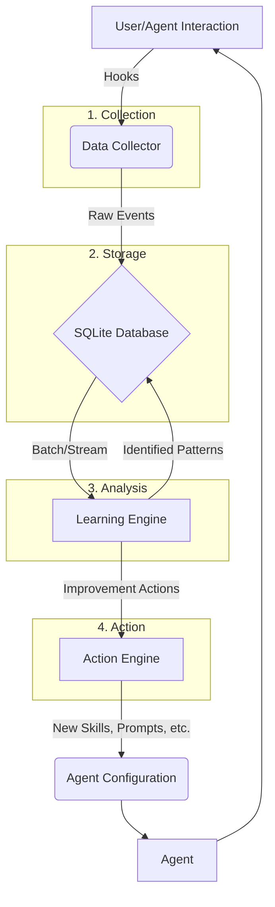

## Executive Summary
This document outlines a research and development plan for a continuous learning system to enhance the autonomy of AI coding agents within the `claudemem` ecosystem. The proposed system leverages the existing hook infrastructure to capture rich user-agent interaction data, which is then analyzed to identify patterns of agent error, repetitive user tasks, and workflow inefficiencies. By learning from these interactions, the system can automatically generate new skills, refine agent prompts, and suggest workflow optimizations, creating a powerful feedback loop that drives progressive agent autonomy.

Our core proposal is a three-part architecture: a **Data Collector** that ingests interaction events, a **Learning Engine** that analyzes this data for improvement opportunities, and an **Action Engine** that translates these opportunities into concrete artifacts like new skills, subagents, or updated configurations. This approach moves beyond simple feedback mechanisms to create a system that actively co-evolves with the user, learning their patterns and proactively automating their tasks. Key innovations include the detection of "implicit corrections" (e.g., when a user modifies agent-generated code), the automated generation of specialized subagents to enforce project-specific coding standards, and a framework for the self-evolution of prompt templates.

This system is designed with privacy and security as first principles, ensuring that all learning is either project-specific or opt-in for global contributions. The implementation roadmap is phased, starting with robust data collection and moving progressively towards more advanced autonomous improvement capabilities. The ultimate vision is an AI assistant that not only responds to commands but actively learns from every interaction to become a more intelligent, efficient, and indispensable partner in the software development lifecycle.

## Data Collection Recommendations
To enable meaningful learning, a rich dataset of user-agent interactions must be collected. This data can be captured using the existing hook system (`SessionStart`, `PreToolUse`, `PostToolUse`, `Stop`, etc.). Each event should be logged with a unique `session_id`, `interaction_id`, timestamps, and project context.

### 1. Core Interaction Data
-   **User Prompt (`UserPromptSubmit` hook):**
    -   **Data:** The full text of the user's prompt or question.
    -   **Rationale:** This is the primary signal of user intent. It's the starting point for any analysis of task type, complexity, and success. We can use this to cluster common user requests.
-   **Agent Reasoning & Response:**
    -   **Data:** The agent's internal monologue (thought process) and the final response presented to the user.
    -   **Rationale:** Understanding *why* an agent chose a particular approach is crucial for debugging its errors. It allows us to distinguish between flawed reasoning and poor execution.
-   **Tool Usage (`PreToolUse`/`PostToolUse` hooks):**
    -   **Data:** `tool_name`, `tool_input` parameters, and the `tool_response` (both stdout and stderr).
    -   **Rationale:** This provides a structured view of the agent's actions. It's the ground truth of what the agent *did*. Analyzing sequences of tool calls can reveal common workflows or points of failure.

### 2. User Feedback Data (Explicit & Implicit)
-   **Explicit User Corrections:**
    -   **Data:** User prompts that contain corrective language (e.g., "No, that's not right, try...", "You forgot to...", "The tests failed, fix...").
    -   **Rationale:** This is the strongest signal for identifying agent mistakes. Natural language processing (NLP) can be used to classify these corrections.
-   **Implicit User Corrections (Code):**
    -   **Data:** A `diff` of a file immediately after it was written or modified by an agent. This requires monitoring file changes (`watcher`) post-tool use.
    -   **Rationale:** This is a powerful implicit signal. If a user consistently modifies code an agent just wrote, it implies the agent's output was incomplete, incorrect, or not up to the user's standards. These diffs are high-quality training data for fine-tuning code generation.
-   **Implicit User Corrections (Tools):**
    -   **Data:** A user manually running a tool (e.g., `Bash`) with similar but slightly different parameters immediately after an agent's `PostToolUse` event.
    -   **Rationale:** This suggests the agent's tool usage was close but not quite right. It's a clear signal for how to improve the agent's use of specific tools.

### 3. Workflow and Session Data
-   **Tool Usage Sequences:**
    -   **Data:** A chronological log of all tools used within a session.
    -   **Rationale:** Sequences like `Read` -> `Edit` -> `Bash(test)` represent common development workflows. We can mine these sequences to find frequently co-occurring tool calls, which can then be abstracted into new, more powerful skills.
-   **Session Outcome (`Stop` hook):**
    -   **Data:** A label indicating whether the session was successful, failed, or abandoned. This could be explicitly asked of the user ("Did this resolve your issue?"), or inferred.
    -   **Rationale:** This provides a high-level performance metric for the agent. We want to maximize the rate of successful sessions over time.
-   **File Edit History:**
    -   **Data:** A log of files that are frequently edited together within a single session.
    -   **Rationale:** This can reveal implicit dependencies in the codebase that are not captured by static analysis. For example, if `fileA.ts` and `fileB.ts` are always edited together, a future agent working on `fileA.ts` should be prompted to consider `fileB.ts`.

## Learning Architecture
A modular architecture is proposed to handle the continuous learning lifecycle. It consists of three main components: a Data Collector, a Learning Engine, and an Action Engine.

### 1. Data Collector & Storage (SQLite Extension)
-   **Mechanism:** A lightweight process, triggered by the existing hook system. Its sole responsibility is to capture the data points defined in the previous section and write them to a dedicated SQLite database.
-   **Schema Extension:** We will extend the existing `claudemem` SQLite database with new tables:
    -   `sessions`: `session_id`, `project_id`, `start_time`, `end_time`, `outcome`.
    -   `interactions`: `interaction_id`, `session_id`, `timestamp`, `user_prompt`, `agent_response`, `agent_reasoning`.
    -   `tool_calls`: `tool_call_id`, `interaction_id`, `tool_name`, `tool_input`, `tool_output_stdout`, `tool_output_stderr`, `was_corrected` (boolean).
    -   `code_corrections`: `correction_id`, `tool_call_id`, `file_path`, `diff`.
-   **Rationale:** Using SQLite keeps the learning system self-contained and local, respecting user privacy. The structured schema allows for efficient querying during the analysis phase.

### 2. Learning Engine (Batch & Real-time Analysis)
-   **Mechanism:** A background process that runs analysis jobs on the collected data. This can be triggered periodically (e.g., nightly batch) or in near real-time.
-   **Batch Analysis:** Performs computationally expensive tasks like clustering user prompts, mining for sequential patterns in tool usage, and analyzing the outcome of all sessions over the last week.
-   **Real-time Analysis:** Focuses on the current session. It can detect immediate, simple patterns like a user correcting a tool's parameters, providing instant feedback or suggestions.
-   **Output:** The engine's output is twofold: it writes identified patterns and metrics back to the database (e.g., in a `learned_patterns` table) and triggers the Action Engine with specific improvement instructions.

### 3. Action Engine (Auto-Improvement Generation)
-   **Mechanism:** This component receives instructions from the Learning Engine and takes concrete actions.
-   **Responsibilities:**
    -   **Skill Generation:** If the Learning Engine identifies a common sequence of tool calls, the Action Engine can use a template to generate a new skill file (e.g., a `.ts` file with a bash command sequence) and register it.
    -   **Subagent Generation:** For patterns like coding standard violations, it can generate a new subagent with a specialized prompt (e.g., "You are a 'linter' agent. Your task is to fix the following code to adhere to the project's ESLint rules.").
    -   **Prompt Refinement:** It can update the `ai-instructions.ts` file to refine prompts based on A/B testing results or identified failure modes.
    -   **User Notifications:** It can present findings to the user, such as, "I noticed you often run `linter` after `generate`. I can create a new `generate-and-lint` skill for you. Would you like me to do that?"
